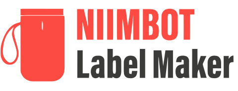

<div align="center">
  
</div>

# `niimprint` &mdash; Niimbot Printer Client

A Python library and CLI tool for printing to NIIMBOT label printers with multiple connectivity options.

## ✨ Features

- **🖨️ Multi-Printer Support**: Compatible with B1, B18, B21, D11, D110 models
- **🔌 Multiple Connection Types**: 
  - USB/Serial connection with auto-detection
  - Classic Bluetooth with native macOS support
  - **Bluetooth Low Energy (BLE)** with cross-platform compatibility
- **🎯 Smart Device Discovery**: Built-in BLE scanner to find your printer automatically
- **🔄 Image Processing**: Automatic image rotation and size validation
- **⚡ Performance Optimized**: Configurable packet batching for faster printing
- **🛠️ Developer Friendly**: Modern Python packaging with [uv](https://docs.astral.sh/uv/) and type hints
- **📱 Cross-Platform**: Works on Windows, macOS, and Linux
- **🎨 Beautiful CLI**: User-friendly command-line interface with helpful error messages

## Installation

Recommended method is to use [uv](https://docs.astral.sh/uv/) and install with `uv sync`. Project is tested on Python 3.11, but should work on other versions.

## Usage

```
$ python niimprint --help

Usage: niimprint [OPTIONS]

Options:
  -m, --model [b1|b18|b21|d11|d110]     Niimbot printer model  [default: b21]
  -c, --conn [usb|bluetooth|ble]       Connection type  [default: usb]
  -a, --addr TEXT                       Bluetooth/BLE MAC address OR serial device path
  -d, --density INTEGER RANGE          Print density  [default: 5; 1<=x<=5]
  -r, --rotate [0|90|180|270]          Image rotation (clockwise)  [default: 0]
  -i, --image PATH                     Image path  [required]
  -v, --verbose                        Enable verbose logging
  -b, --batch-size INTEGER RANGE       Number of packets to batch together for better performance  [default: 10; 1<=x<=50]
  --help                               Show this message and exit.
```

### Image orientation:

Generally, the image comes out of the printer with the same orientation you see it on your screen. You can have your input image rotated as you like, but adjust its orientation by passing `-r <...>` flag. See the image below for clarification.

[]()

<!-- Excalidraw link: https://excalidraw.com/#json=vYHMBohMn5GeB-5M6SNch,TsxRmh_WKUfzYjL183FGfg -->

### Image resolution:

As far as we've tested, Niimbot printers have **8 pixels per mm** (~203 dpi) resolution. The CLI prints the image you provided as-is, without any checks of the actual label size, so be careful. However the script will check if the image width is too big for selected printer. The maximum width in pixels is usually slightly less than specified maximum width in mm:

- **B21, B1, B18**: max 384 pixels (almost equal to 50 mm * 8 px/mm = 400)
- **D11**: max 96 pixels (almost equal to 15 mm * 8 px/mm = 120)

### USB connection:

For USB connection, you can omit the `--addr` argument and let the script auto-detect the serial port. However, it will fail if there're multiple available ports. On linux, serial ports can be found at `/dev/ttyUSB*`, `/dev/ttyACM*` or `/dev/serial/*`. On windows, they will be named like `COM1`, `COM2` etc. Check the device manager to choose the correct one.

### Bluetooth connection:

It seems like B21 and B1 (and maybe other models?) have two bluetooth adresses. They have the same last 3 bytes, but the first 3 are rotated (for example `AA:BB:CC:DD:EE:FF` and `CC:AA:BB:DD:EE:FF`). Connection works only if you disconnect from one and connect to the other. After connecting via bluetoothctl you may get `org.bluez.Error.NotAvailable br-connection-profile-unavailable` error, but printing works fine regardless.

To identify which address is the correct one, run `bluetoothctl info` on the address you want to check. The incorrect one might list `UUID: Generic Access Profile` and `UUID: Generic Attribute Profile`, while the correct one will list `UUID: Serial Port`.

#### macOS Bluetooth Support

On macOS, the application automatically uses a native Bluetooth transport implemented with PyObjC and the IOBluetooth framework. This provides better compatibility and stability compared to the Linux socket-based approach.

The CLI will automatically detect when running on macOS and use the native transport. If PyObjC is not available, it will fall back to the standard Bluetooth transport.

### Bluetooth Low Energy (BLE) connection

NIIMBOT printers also support Bluetooth Low Energy (BLE) communication. According to the [NIIMBOT hardware interfacing documentation](https://niim-docs.pages.dev/documents/NIIMBOT_hardware_interfacing), most NIIMBOT printers use:

- **Service UUID**: `e7810a71-73ae-499d-8c15-faa9aef0c3f2`
- **Characteristic UUID**: `bef8d6c9-9c21-4c9e-b632-bd58c1009f9f`

The BLE transport uses the [Bleak](https://bleak.readthedocs.io/) library which provides cross-platform support for Windows, macOS, and Linux.

#### Finding BLE Device Addresses

**Important:** On macOS, BLE devices appear with UUID-style addresses instead of traditional MAC addresses.

**To discover your printer's BLE address:**

1. **Use the included scanner script:**
   ```bash
   uv run python scan_ble_devices.py
   ```

2. **Example output:**
   ```
   === NIIMBOT BLE Device Scanner ===
   🔍 Scanning for BLE devices (timeout: 10.0s)...

   🖨️  Found 1 NIIMBOT printer(s):
   ┌─────────────────────────────────────────┬──────────────────┬──────┐
   │ Address/UUID                            │ Name             │ RSSI │
   ├─────────────────────────────────────────┼──────────────────┼──────┤
   │ A1B2C3D4-E5F6-7890-ABCD-EF1234567890    │ D110-AB12345678  │  -56 │
   └─────────────────────────────────────────┴──────────────────┴──────┘

   💡 Usage:
      uv run python -m niimprint -m d110 -c ble -a A1B2C3D4-E5F6-7890-ABCD-EF1234567890 -i your_image.png

   📊 Scan completed: 1 NIIMBOT printer(s), 8 other device(s)
   ```

3. **Use the discovered address:**
   ```bash
   uv run python -m niimprint -c ble -a "A1B2C3D4-E5F6-7890-ABCD-EF1234567890" -i image.png
   ```

**Address Format by Platform:**
- **Linux/Windows:** Traditional MAC address format (`AA:BB:CC:DD:EE:FF`)
- **macOS:** UUID format (`A1B2C3D4-E5F6-7890-ABCD-EF1234567890`)

**Scanner Options:**
```bash
uv run python scan_ble_devices.py --help              # Show all options
uv run python scan_ble_devices.py --timeout 20        # Scan for 20 seconds
uv run python scan_ble_devices.py --show-all          # Show all BLE devices
```

**Troubleshooting:**
- Make sure your printer is powered on and in discoverable mode
- Run the scanner multiple times if the printer doesn't appear immediately
- Try increasing scan timeout for better detection
- Some printers may take time to become discoverable after power-on

## Examples

**B21, USB connection, 30x15 mm (240x120 px) label**

```
uv run python -m niimprint -c usb -a /dev/ttyACM0 -r 90 -i examples/B21_30x15mm_240x120px.png
```

[]()

**B21, Bluetooth connection, 80x50 mm (640x384 px) label**

```
python niimprint -c bluetooth -a "E2:E1:08:03:09:87" -r 90 -i examples/B21_80x50mm_640x384px.png
```

[]()

**D110, BLE connection, 96x200 px label**

```
# macOS (UUID format)
uv run python -m niimprint -c ble -m d110 -a "A1B2C3D4-E5F6-7890-ABCD-EF1234567890" -i examples/D110_test_96x200px.png

# Linux/Windows (MAC format)  
uv run python -m niimprint -c ble -m d110 -a "26:03:03:C3:F9:11" -i examples/D110_test_96x200px.png
```

## Changelog

**Fork differences from original version:**

- Tested on Niimbot B1, B18, B21, D11, D110 and Python 3.11
- Added transport abstraction: switch between bluetooth, BLE and USB (serial)
- Added **Bluetooth Low Energy (BLE)** support using [Bleak](https://bleak.readthedocs.io/) library for cross-platform compatibility
- Built-in BLE device scanner for easy printer discovery
- Disabled checksum calculation for image encoding (works fine without it so far)
- Switched to [click](https://click.palletsprojects.com/) CLI library instead of argparse
- Integrated [pyproject.toml](https://pip.pypa.io/en/stable/reference/build-system/pyproject-toml/) and [uv](https://docs.astral.sh/uv/)
- Integrated [pre-commit](https://pre-commit.com/) and [ruff](https://docs.astral.sh/ruff/), re-formatted all files
- Native macOS Bluetooth support using PyObjC and IOBluetooth framework
- Configurable packet batching for improved performance
- Miscellaneous refactoring / file renaming / etc.

## My use case

I use this library to print labels with today's date on them. It is running as a script on my Home Assistant (on Raspberry Pi 4).

In `/config/niimbot/print.sh` I have a script to orchestrate the printing.

```bash
#!/bin/bash

set -e 

base_path="/config/niimbot"
cd "$base_path/niimprint"

uv run python utils/today.py 
uv run python -m niimprint -m d110 -c bluetooth -a 06:25:E8:4A:12:2B -i date_image.png -r 90 -v -b 50
```

In `configuration.yaml` I have a script to print the label.

```yaml
shell_command:
  print_niimbot: "bash /config/niimbot/print.sh"
```

This repo is checked into `/config/niimbot/niimprint`. `uv` handles installing the dependencies automatically. The script is being run inside a `homeassistant` container which fortunately has `uv` installed.

I then configured a physical button to trigger this script.

The BLE has an advantage of not requiring a pairing process. The disadvantage is that it was less reliable for me so I'm using bluetooth classic instead. On my MacBook Pro, both work fine.

## Licence

[MIT](https://choosealicense.com/licenses/mit/). Originally developed by [kjy00302](https://github.com/kjy00302), forked & enhanced by [AndBondStyle](https://github.com/AndBondStyle), forked again and maintained by [Tomáš Krejčí](https://github.com/tomas789)
